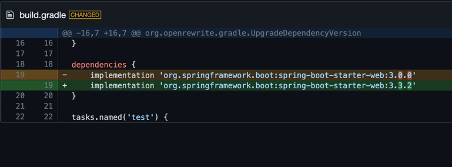

# Test upgrading dependency with private repo

Run the following

```
mod build .
mod run . --recipe org.openrewrite.gradle.UpgradeDependencyVersion -PgroupId=org.springframework.boot -PartifactId=spring-boot-starter-web -PnewVersion=latest.release
```

expected outcome:

